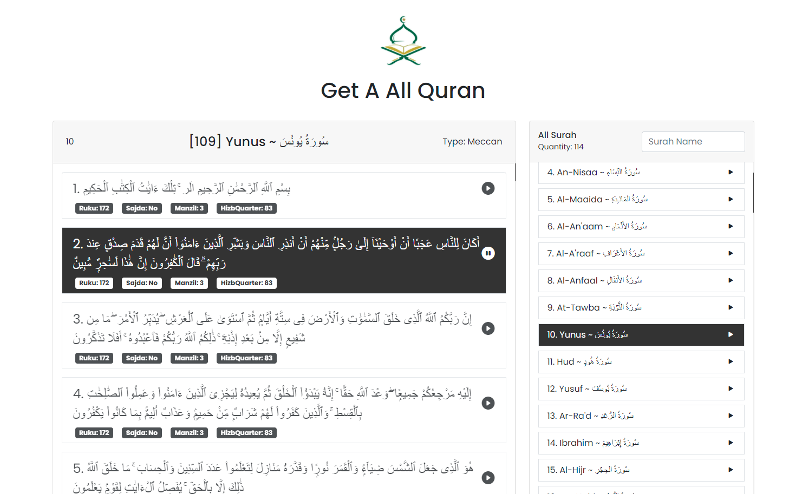

# Quran Application Using Vanilla JavaScript & API

This is simple quran application using javascript  and api. Here you will get a lot's of features just check it out and if you have any suggestion about this project please feel free to leave a message thanks.

# Using Technologies
- HTML5/HTML
- CSS3/CSS 
- Bootstrap Framework
- Vanilla JavaScript & API
- VS Code Editor
- Github / Git bash
- Google Fonts (Poppins)
- Quran API 
- Bootstrap Icons
and many more....

# Features
- Get a each Surah with Audio Translate by clicking each ayats
-

# Live Link in about

# Demo Preview this project 

> Thanks for reach out me on github
